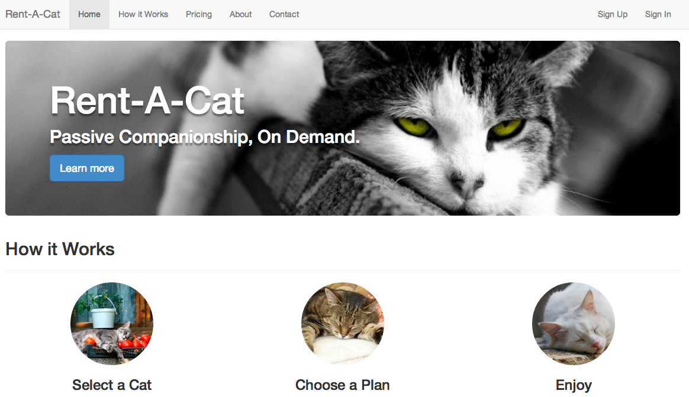
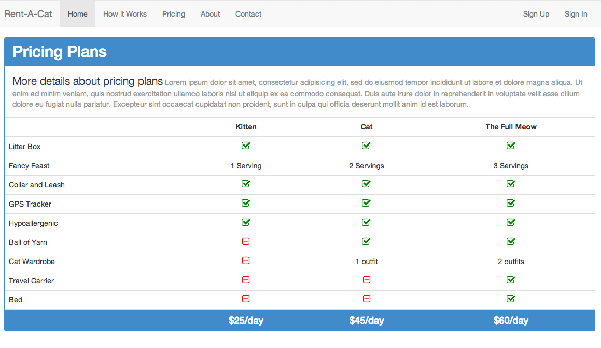
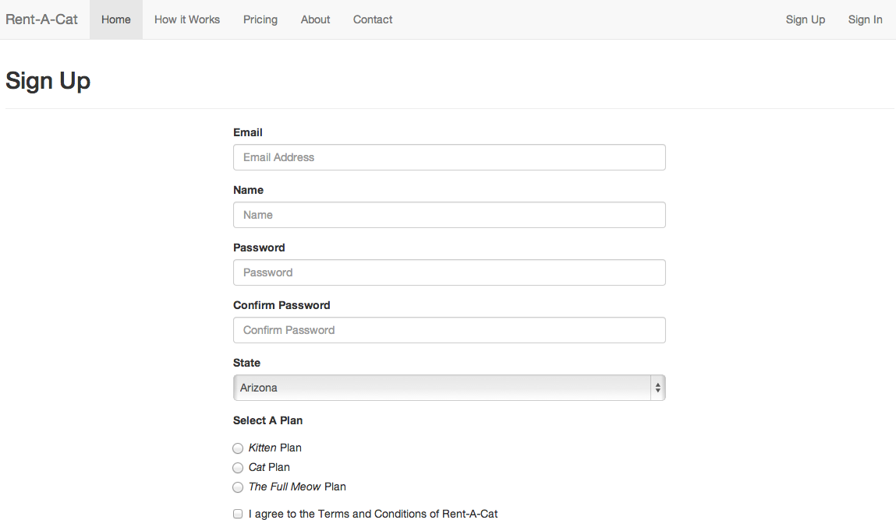

# Intro to Twitter Bootstrap

* [Presentation Slides]()
* [Workshop Files](https://github.com/darbyfrey/twitter-bootstrap-workshop/archive/master.zip)

In this workshop you will learn how to use some of the features of Twitter Bootstrap 3.0 within the context of building a cat rental website.

## Section #1 - Jumbotron
[Jumbotron Docs](http://getbootstrap.com/components/#jumbotron)

* Add a Jumbotron as the first section in the main container
* Add `Rent-A-Cat` in an `h1` inside the Jumbotron
* Put the tagline in a `p` tag inside the Jumbotron, add a class of `.h2`
* Add a `Learn More` button inside the Jumbotron, give it the style of primary and large
* Add the custom class `.jumbotron-background` to the main Jumbotron element
* Add the custom class `.shadow-text` to the text elements in the Jumbotron

## Section #2 - How it Works
[Page Header Docs](http://getbootstrap.com/components/#page-header)

* Add a Page Header with an `h2` of `How it Works`
* Add a row with 3 columns, use the `.col-sm-4` grid class for each column
* Each column should contain:
    * An image of a cat styled with the `.img-circle` class
    * An `h3` heading for each of the steps: `Select a Cat`, `Choose a Plan`, `Enjoy`
    * Some text descibing the step
    * A `View Details` button using the `.btn-default` style
* Add the class `.text-center` to each column

## Section #3 - Pricing

**Part 1**

[Panel Docs](http://getbootstrap.com/components/#panels)

* Create a Panel with a Heading and a Body
* Give the Panel the style of `.panel-primary`
* Add the class of `.h2` to the Panel Heading and give it the text of `Pricing Plans`
* Add some descriptive text in the Panel Body. Play around with some of the typography styles such as `.lead` and `.text-muted`.

[Body Copy Docs](http://getbootstrap.com/css/#type-body-copy)

[Type Emphasis Docs](http://getbootstrap.com/css/#type-emphasis)

* Add a table within the Panel for the pricing plan information
* The table heading should contain the names of the pricing plans (i.e. `Kitten`, `Cat`, `The Full Meow`)
* The table footer should contain the prices for each plan ($25/day, $45/day, $60/day). Give each pricing `td` a class of `.h4`, and add the custom class of `.pricing-row` to the `tr`
* Add rows to the table body for each feature - each should contain:
    * The feature description (i.e. `Collar and Leash`)
    * Add an `x` or a `-` to indicate if the feature is available for the given pricing plan

**Part 2**

* Add the custom class of `.pricing-table` to the table tag
* Install Font Awesome - http://fortawesome.github.io/Font-Awesome/
* With Font Awesome installed, now change out the `x`'s and `-`'s with `i` tags with the classes of `.icon-check` or `.icon-check-minus`.
* Add the class of `.text-center` to the table and all table heading cells
* Add the class of `.text-left` to the cells for all feature descriptions

## Section #4 - Sign Up

[Forms Docs](http://getbootstrap.com/css/#forms)

* Add a Page Header with an `h2` of `Sign Up`
* Create a Form section with text inputs for `Email`, `Name`, `Password` and `Confirm Password`
* Each input element should:
  * Be wrapped in a div with the class of `.form-group`
  * Include a label tag with a class of `.control-label`
  * Include an input element with a class of `.form-control`
* Add a select menu for `State`
* Add a radio select for `Select A Plan`
* Add a `Sign Up` button with the style of primary

## Finished Screenshots

* * *

* * *
